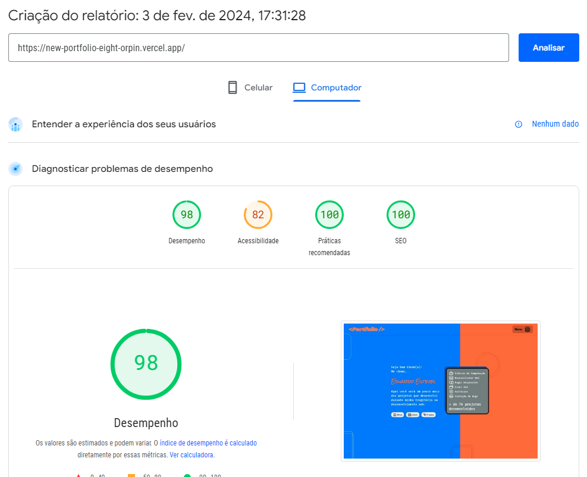
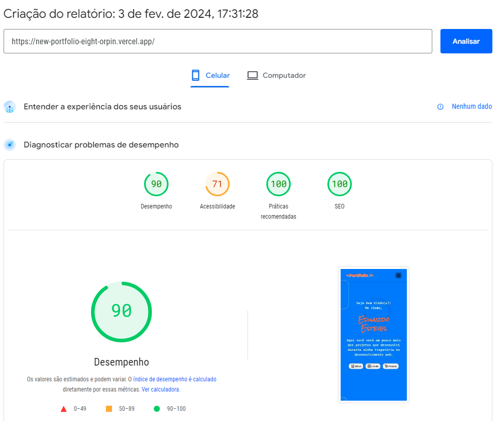
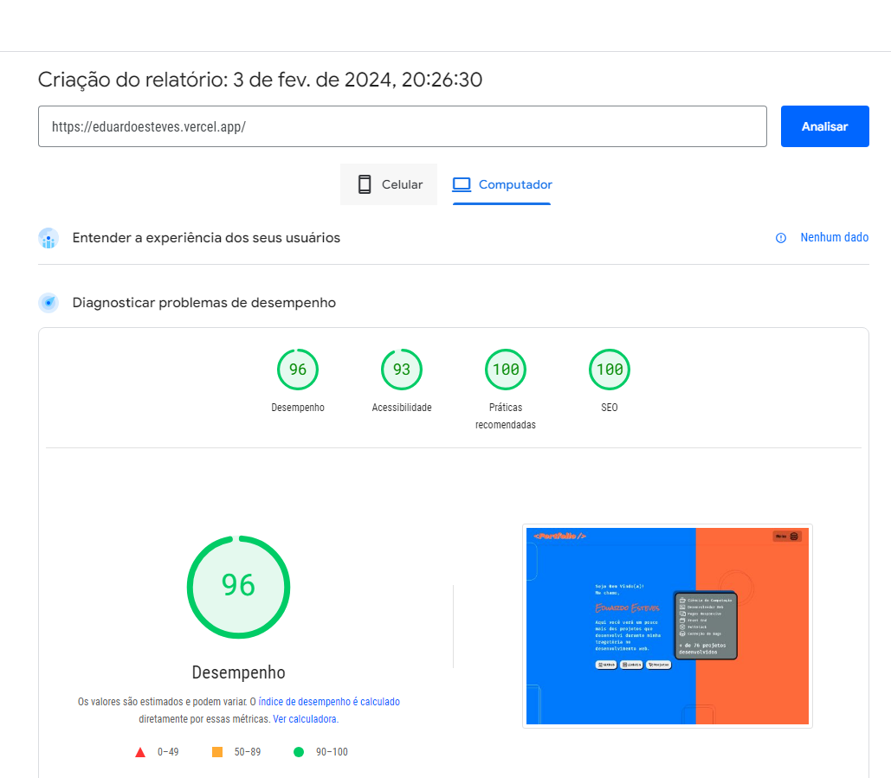
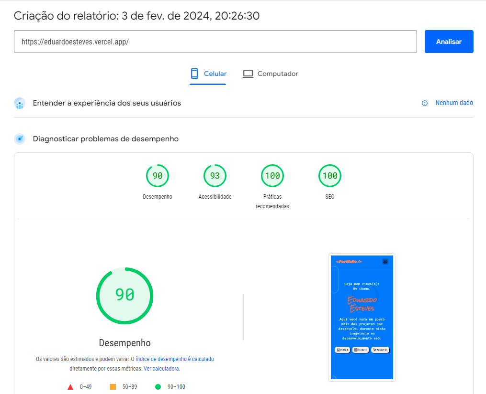

# Portfolio 🏆🔥

Site: https://eduardoesteves.vercel.app

Esse projeto está sendo criando, pensando na fácil manutenção, simplicidade para achar as informações e animações para tornar sua estadia no site mais legal.

Layout no Desktop

Layout no Mobile

## Para iniciar o projeto:

    pnpm create vite@latest
    |
    name: porfolio
    |
    cd portfolio
    |
    pnpm i
    |
    code . (se assim como eu, você utilizar o VS Code)

## Pacotes utilizados:

    🔴 sass
    🔵 react
    🟢 react-dom
    🟡 phosphor-react

Observação: Cada componente terá uma função e apenas!

## Performance do site

O projeto foi adicionado no Github e na Vercel. Com o mesmo funcionando corretamente, foi efetuado a verificação de performance pelo site da Google que inicialmente, encontrou alguns erros e ofereceu algumas sugestões
Site da Google: https://pagespeed.web.dev/analysis/

Inicialmente o site foi qualificado com as seguintes notas...

Para computador

Para celular

Após os devidos reajustes solicitados pelo site e algumas atualizações no projeto...

Para computador

Para celular

